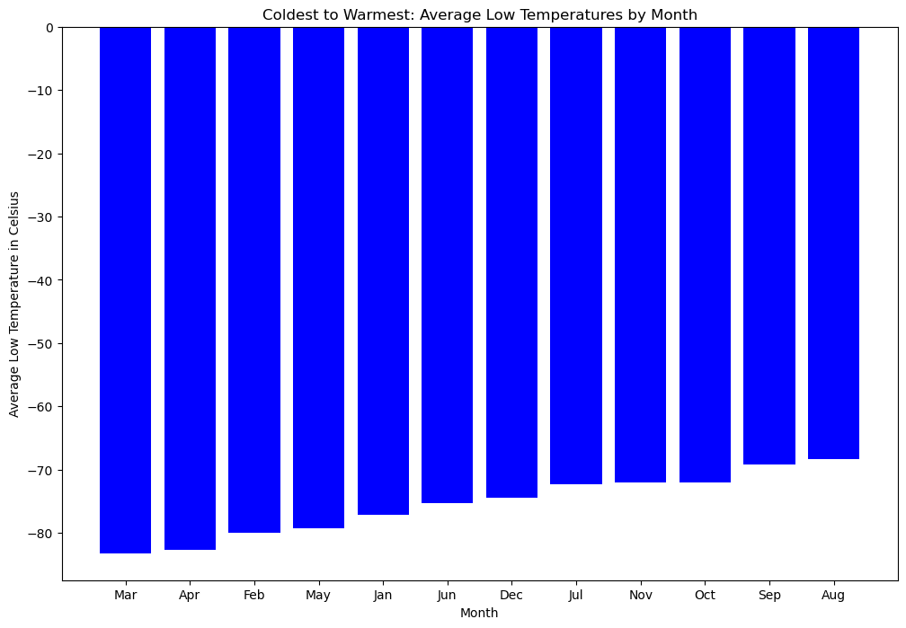
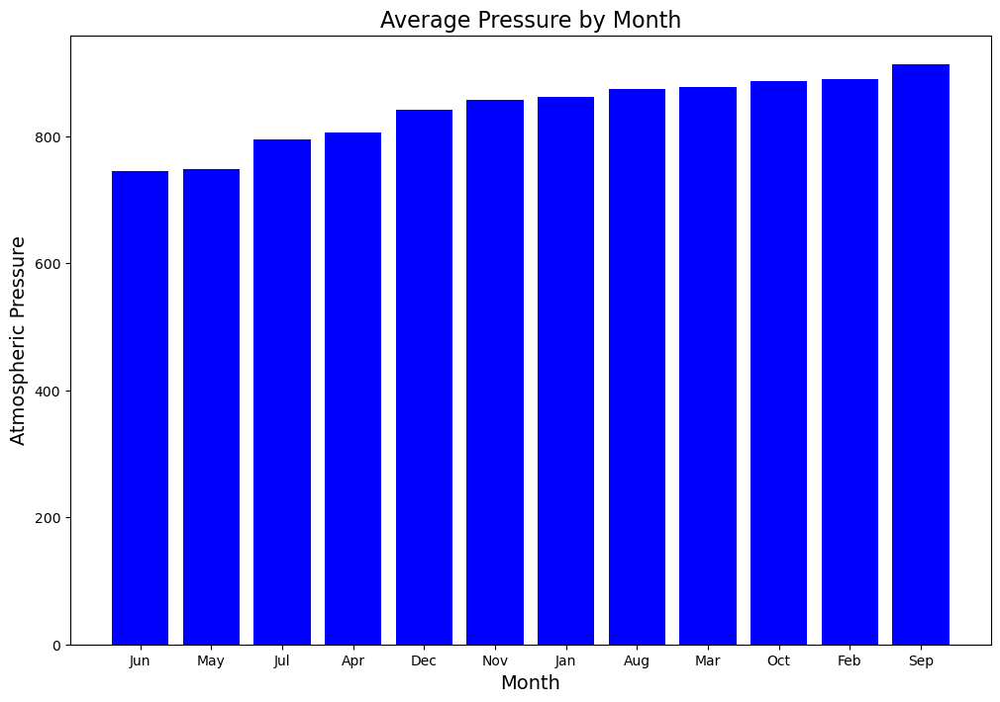
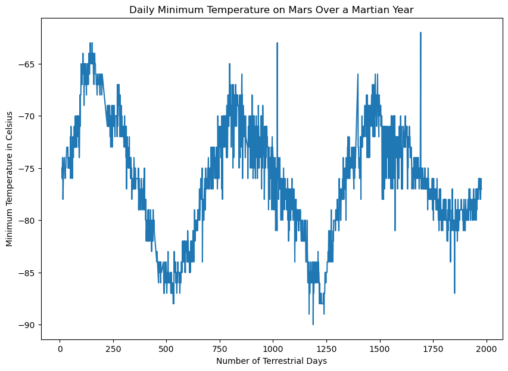

# webscrape-challenge
KU Boot Camp Week 11 Challenge

# Mars News and Weather Data Scraping and Analysis Challenge 🌌

## Overview 📊

This challenge focuses on developing web scraping and data analysis skills through targeted tasks with Mars-related data sources. Employ automated browsing techniques and Python libraries such as `Beautiful Soup` and `Pandas` to extract and analyze data from two specific Mars-themed websites. The results of these tasks will contribute to a better understanding of both the latest news about Mars and detailed weather patterns on the Martian surface.

## Parts 📝

1. **Mars News Scraper** 📰: Scrape titles and preview text from a Mars news website to gather the latest updates using automated browsing and Beautiful Soup.
2. **Mars Weather Analyzer** 🌡️: Retrieve and analyze Mars weather data, focusing on temperature and atmospheric pressure, with the aim of identifying trends and patterns through data visualization.

## Part 1 Deliverable: Scrape Titles and Preview Text from Mars News 🗞️

### Step 1: Visit the Website 🌐
Use automated browsing to visit the Mars news site. Use Chrome DevTools to inspect the page and identify the elements to scrape.

**Mars News Site URL:** [Mars News](https://static.bc-edx.com/data/web/mars_news/index.html)

### Step 2: Scrape the Website ⛏️
Create a Beautiful Soup object to extract text elements from the website.

### Step 3: Store the Results 💾
Extract the titles and preview text of the news articles and store them in Python data structures. Format each title-and-preview pair as a dictionary with keys `title` and `preview`. Store all the dictionaries in a Python list. Example:

```
{'title': "NASA's MAVEN Observes Martian Light Show Caused by Major Solar Storm",
 'preview': "For the first time in its eight years orbiting Mars, NASA’s MAVEN mission witnessed two different types of ultraviolet aurorae simultaneously, the result of solar storms that began on Aug. 27."
}
```
## Part 2 Deliverable: Scrape and Analyze Mars Weather Data 🌦️

### Step 1: Visit the Website 🌐
Use automated browsing to visit the Mars Temperature Data Site. Employ Chrome DevTools to identify the classes usable for scraping the table.

**Mars Temp Data Site URL:** [Mars Temperature Data](https://static.bc-edx.com/data/web/mars_facts/temperature.html)

### Step 2: Scrape the Table ⛏️
Utilize Beautiful Soup to scrape the data from the HTML table.

### Step 3: Store the Data 💾
Assemble the scraped data into a Pandas DataFrame, ensuring the column headings match those on the website:
- `id`: Identification number of a transmission from the Curiosity rover.
- `terrestrial_date`: Date on Earth.
- `sol`: Number of elapsed sols (Martian days) since Curiosity landed on Mars.
- `ls`: Solar longitude.
- `month`: Martian month.
- `min_temp`: Minimum temperature of a Martian day (in Celsius).
- `pressure`: Atmospheric pressure at Curiosity's location.

### Step 4: Prepare Data for Analysis 🔍
Examine and adjust the data types as necessary using Pandas `astype` and `to_datetime` methods.

### Step 5: Analyze the Data 📊

Analyze the dataset to answer the following questions:

1. **How many months exist on Mars?**  
   Based on the dataset, there are 12 months on Mars. However, this equates to approximately 24 Earth months.

2. **How many Martian (and not Earth) days worth of data exist in the scraped dataset?**  
   1,867 days worth of Martian data exist in the scraped dataset.

3. **What are the coldest and warmest months on Mars (at the location of Curiosity)?**  
   March is the coldest month on Mars; August is the warmest month.  
   

4. **Which months have the lowest and highest atmospheric pressure on Mars?**  
   June averages the lowest atmospheric pressure on Mars; September averages the highest atmospheric pressure.  
   

5. **About how many terrestrial (Earth) days exist in a Martian year?**  
   The distance from peak to peak in the plot is roughly 675 days, suggesting a Martian year is about 675 days long. Internet search confirms that a Martian year is equivalent to 687 Earth days.  
   

### Step 6: Save the Data 💾
Export the DataFrame to a CSV file.

## Admin Note 📝

> **⚠️ Important:** This challenge required the use of the Browser object from Splinter, an open-source tool for automating browser actions like visiting URLs, interacting with page elements, and extracting data. However, numerous errors in Jupyter Notebook prompted a switch to using requests.get() to fetch the URL and Beautiful Soup to parse the HTML. After thorough troubleshooting and consultation with the instructor, this workaround was approved for submitting the assignment. Further troubleshooting of Splinter and Chromedriver is planned for a future date.
